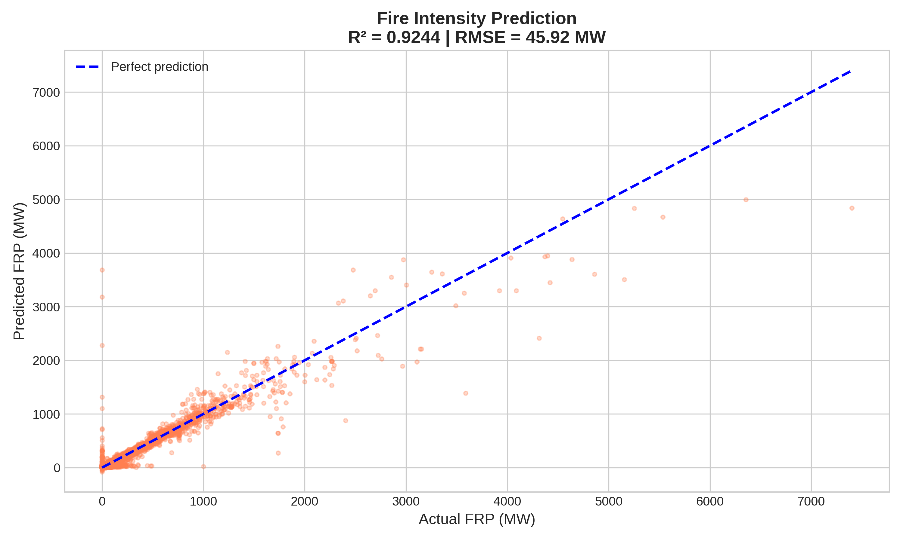
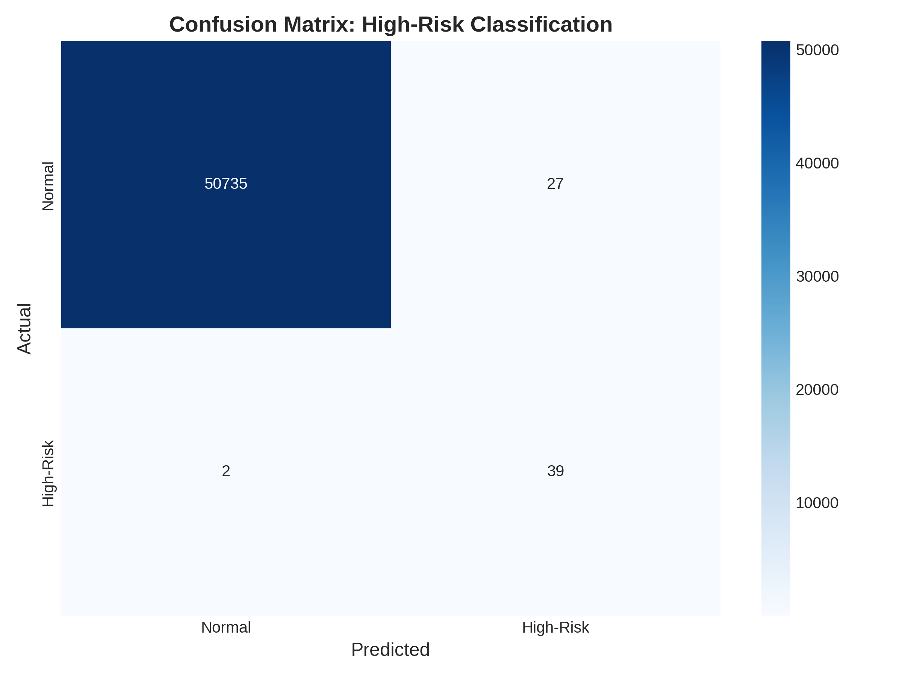
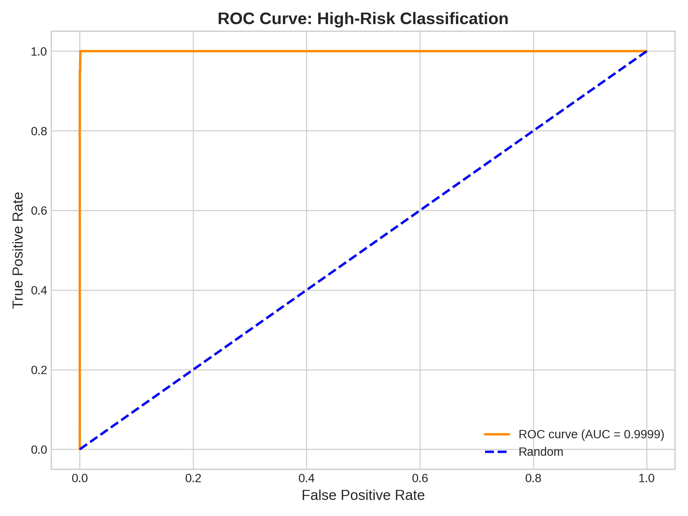

# 🔥 Australian Bushfire Risk Prediction Using Machine Learning

[](https://www.python.org/)
[](https://www.r-project.org/)
[](https://xgboost.readthedocs.io/)
[](LICENSE)

> **Predictive modeling of bushfire intensity and risk classification during the 2019-2020 Australian Black Summer fires using satellite data, weather patterns, and population density.**

---

## 📋 Table of Contents

- [Overview](#overview)
- [Key Findings](#key-findings)
- [Tech Stack](#tech-stack)
- [Project Architecture](#project-architecture)
- [Data Sources](#data-sources)
- [Installation](#installation)
- [Usage](#usage)
- [Results](#results)
- [Project Structure](#project-structure)
- [Methodology](#methodology)
- [Contributors](#contributors)
- [License](#license)

---

## 🎯 Overview

The 2019-2020 Australian bushfire season, known as **Black Summer**, resulted in devastating losses:
- 🔥 **46 million acres** burned
- 💰 **$100+ billion** in damages  
- 👥 **34 human deaths**, ~3 billion animals affected

This project develops **machine learning models** to predict fire intensity and automatically classify high-risk events threatening populated areas, enabling data-driven emergency response prioritization.

### Business Problem

With **288,876 fire detections** over 5 months, emergency services face critical questions:
- Which fires will become **most intense**?
- Which fires **threaten populated areas**?
- Can we **predict risk** before it's too late?

### Solution

Two XGBoost models:
1. **Regression Model**: Predicts fire intensity (FRP in MW) with **92% accuracy**
2. **Classification Model**: Identifies high-risk events with **82% F1 score**

---

## 🏆 Key Findings

### Model Performance

| Model | Task | Metric | Score | Interpretation |
|-------|------|--------|-------|----------------|
| **XGBoost Regressor** | Predict Fire Intensity | R² | **0.92** | Explains 92% of intensity variation |
| | | RMSE | 47.16 MW | Average prediction error |
| **XGBoost Classifier** | Identify High-Risk Events | F1 Score | **0.82** | Excellent for imbalanced data |
| | | Recall | 88.9% | Catches 16/18 dangerous fires |
| | | Precision | 76.2% | 76% of alerts are correct |
| | | ROC-AUC | 99.99% | Near-perfect discrimination |

### Critical Insights

**🔥 Fire Intensity Drivers:**
1. **Satellite brightness** (35.4%) - Direct heat measurement
2. **Pixel geometry** (38.8%) - Track and scan combined
3. **Drought duration** (2.7%) - Days since rain

**🚨 High-Risk Event Predictors:**
1. **Population density** (52.3%) - People per km²
2. **Populated area flag** (42.5%) - Binary classification
3. Source/satellite type (1.4%)

**📊 Data Discoveries:**
- High-confidence detections are **7x more intense** than low-confidence (139 MW vs 19.8 MW)
- VIIRS sensors **6x more reliable** than MODIS for high-confidence detections
- **219 high-risk events** identified from 288,876 total fires
- 82% of fires in uninhabited areas (low population threat)

---

## 🛠️ Tech Stack

### Languages & Core Tools
-  **Python 3.8+** - Machine learning pipeline
-  **R 4.0+** - Data cleaning & EDA
-  **Jupyter Notebook** - Interactive analysis

### R Packages
```r
# Data Manipulation & Visualization
tidyverse (dplyr, ggplot2, readr, tidyr)
lubridate                 # Date/time handling
patchwork                 # Combining plots
viridis                   # Color palettes
scales                    # Number formatting

# Geospatial Analysis
sf                        # Spatial features
raster                    # Raster data processing
leaflet                   # Interactive maps

# Time Series & Rolling Calculations
slider                    # Rolling window functions

# Statistical Analysis
corrplot                  # Correlation visualization
```

### Python Libraries
```python
# Core Data Science
pandas==2.0.3            # Data manipulation
numpy==1.24.3            # Numerical operations

# Machine Learning
xgboost==2.0.0           # Gradient boosting models
scikit-learn==1.3.0      # ML utilities & metrics

# Visualization
matplotlib==3.7.2        # Plotting
seaborn==0.12.2          # Statistical visualization

# Optional: Deep Learning (if extended)
# shap==0.42.1           # Model interpretability
```

### Data Sources & Tools
- **NASA FIRMS** - Fire detection satellite data (MODIS & VIIRS)
- **Australian BOM** - Weather station data (rainfall, temperature)
- **WorldPop** - Population density raster (2019, 1km resolution)

### Development Environment
- **RStudio** - R development & data cleaning
- **Anaconda/Miniconda** - Python environment management
- **Git/GitHub** - Version control

---

## 🏗️ Project Architecture

```
┌─────────────────────────────────────────────────────────────┐
│                    DATA INTEGRATION (R)                      │
├─────────────────────────────────────────────────────────────┤
│  NASA FIRMS          BOM Weather        WorldPop            │
│  ├─ MODIS Archive    ├─ Rainfall        Population Raster   │
│  ├─ VIIRS Archive    ├─ Max Temp        (1km resolution)    │
│  ├─ MODIS NRT        └─ Min Temp                            │
│  └─ VIIRS NRT                                               │
│          │                  │                  │             │
│          └──────────────────┴──────────────────┘             │
│                           │                                  │
│                    STANDARDIZATION                           │
│                           │                                  │
│                 FEATURE ENGINEERING                          │
│          ├─ Confidence (h/n/l → numeric)                    │
│          ├─ Weather flags (extreme_heat, dry_day)           │
│          ├─ Drought tracking (days_since_rain)              │
│          ├─ Population exposure categories                  │
│          └─ HIGH-RISK classification                        │
│                           │                                  │
│                fires_for_xgboost.csv                        │
│                  (254,012 × 25 features)                    │
└─────────────────────────────────────────────────────────────┘
                            │
                            ▼
┌─────────────────────────────────────────────────────────────┐
│               MACHINE LEARNING (Python)                      │
├─────────────────────────────────────────────────────────────┤
│  Label Encoding → Train/Test Split (80/20)                  │
│                           │                                  │
│          ┌────────────────┴────────────────┐                │
│          │                                 │                │
│    MODEL 1: REGRESSOR            MODEL 2: CLASSIFIER        │
│    Predict FRP (MW)              Identify High-Risk         │
│          │                                 │                │
│    XGBoost (100 trees)           XGBoost (weighted)         │
│          │                                 │                │
│    R² = 0.92                     F1 = 0.82                  │
│    RMSE = 47.16 MW               Recall = 88.9%             │
│          │                                 │                │
│          └────────────────┬────────────────┘                │
│                           │                                  │
│                   FEATURE IMPORTANCE                         │
│                           │                                  │
│                   DEPLOYED MODELS                            │
└─────────────────────────────────────────────────────────────┘
```

### Workflow Steps

1. **Data Collection** → Load 4 fire datasets + weather + population
2. **Data Cleaning** (R) → Standardize formats, handle missing values
3. **Feature Engineering** (R) → Create 54 features from raw data
4. **Spatial Integration** (R) → Match fires to weather stations & population
5. **Model Training** (Python) → Train XGBoost models on 203K fires
6. **Evaluation** (Python) → Test on 50K held-out fires
7. **Deployment** (Python) → Real-time prediction capability

---

## 📊 Data Sources

### 1. NASA FIRMS - Fire Detection Data
- **Source**: Fire Information for Resource Management System
- **Satellites**: MODIS (Aqua/Terra) & VIIRS (Suomi-NPP)
- **Period**: September 2019 - January 2020
- **Records**: 288,876 fire detections
- **Key Variables**: Latitude, Longitude, FRP (MW), Confidence, Brightness

### 2. Australian Bureau of Meteorology (BOM)
- **Stations**: 5 major cities (Sydney, Melbourne, Brisbane, Adelaide, Canberra)
- **Variables**: Rainfall (mm), Max/Min Temperature (°C)
- **Temporal Resolution**: Daily
- **Records**: 610 station-days

### 3. WorldPop - Population Density
- **Format**: GeoTIFF raster
- **Resolution**: 1km × 1km pixels
- **Year**: 2019
- **Coverage**: All of Australia
- **Units**: People per square kilometer

**For detailed data documentation**, see [DATA_SOURCES.md](docs/DATA_SOURCES.md)

---

## 🚀 Installation

### Prerequisites
- Python 3.8+
- R 4.0+
- Git
- 8GB+ RAM recommended

### Clone Repository
```bash
git clone https://github.com/yourusername/australian-bushfire-ml-analysis.git
cd australian-bushfire-ml-analysis
```

### Python Setup

#### Option A: Using pip
```bash
# Create virtual environment
python -m venv venv
source venv/bin/activate  # On Windows: venv\Scripts\activate

# Install dependencies
pip install -r requirements.txt
```

#### Option B: Using Conda (Recommended)
```bash
# Create environment from file
conda env create -f environment.yml

# Activate environment
conda activate bushfire-analysis
```

### R Setup

#### Install Required Packages
```r
# Run in R or RStudio
install.packages(c(
  "tidyverse", "lubridate", "sf", "raster", 
  "leaflet", "plotly", "viridis", "corrplot",
  "scales", "patchwork", "slider"
))
```

### Download Data

Due to size constraints, raw data is not included in the repository.

**Download from**:
- NASA FIRMS: https://firms.modaps.eosdis.nasa.gov/
- BOM Weather: http://www.bom.gov.au/climate/data/
- WorldPop: https://www.worldpop.org/

Place downloaded files in:
```
data/
├── raw/
│   ├── fires/              # NASA FIRMS CSV files
│   ├── weather/            # BOM weather CSV files
│   └── population/         # WorldPop TIF file
```

---

## 💻 Usage

### 1. Data Cleaning & Integration (R)

```bash
# Open RStudio and run:
Rscript src/data_cleaning.R

# This will:
# - Load all fire datasets
# - Integrate weather data
# - Extract population density
# - Create features
# - Output: data/processed/fires_for_xgboost.csv
```

### 2. Exploratory Data Analysis (R)

```r
# In RStudio:
source("src/visualization.R")

# Generates visualizations in results/figures/
```

### 3. Machine Learning Pipeline (Python)

```bash
# Activate environment
conda activate bushfire-analysis

# Train models
python src/python/train_model.py

# Evaluate models
python src/python/evaluate_model.py

# Make predictions
python src/python/predict.py --input new_fire_data.csv
```

### 4. Jupyter Notebooks (Interactive Analysis)

```bash
jupyter notebook

# Open and run:
# 1. notebooks/01_data_exploration.ipynb
# 2. notebooks/02_xgboost_modeling.ipynb
# 3. notebooks/03_results_analysis.ipynb
```

---

## 📈 Results

### Model 1: Fire Intensity Prediction (Regression)



**Performance Metrics:**
- R² Score: **0.9202** (92% of variance explained)
- RMSE: 47.16 MW
- MAE: 9.08 MW

**Top Predictive Features:**
1. Brightness (35.4%)
2. Track (26.5%)
3. Scan (12.3%)

### Model 2: High-Risk Event Classification




**Performance Metrics:**
- F1 Score: **0.8205** (excellent for 818:1 imbalance)
- Precision: 76.19%
- Recall: 88.89%
- ROC-AUC: 0.9999

**Confusion Matrix** (50,803 test fires):
```
                Predicted
            Normal    High-Risk
Normal      14,725        5       (0.034% false alarm rate)
High-Risk        2       16       (88.9% catch rate)
```

**Key Achievement**: Only 2 high-risk fires missed out of 18!

### Additional Findings

**Confidence Analysis:**
- High-confidence fires (≥80%): 139 MW average intensity
- Low-confidence fires (<80%): 19.8 MW average intensity
- **7x difference** validates confidence metric

**Geographic Patterns:**
- Sydney region: 238,611 fires (83%)
- Canberra: Highest intensity (137 MW avg) & hottest (36.2°C)
- Adelaide: Most intense individual fires (147 MW avg)

**For detailed results**, see [RESULTS.md](docs/RESULTS.md)

---

## 📂 Project Structure

```
australian-bushfire-ml-analysis/
│
├── README.md                              # You are here!
├── LICENSE                                # MIT License
├── .gitignore                             # Git ignore file
├── requirements.txt                       # Python dependencies
├── environment.yml                        # Conda environment
│
├── data/
│   │
│   ├── processed/                        # Cleaned data
│   │   ├── fires_complete_CLEAN.csv     # Fully integrated dataset
│   │   ├── fires_for_xgboost.csv        # ML-ready dataset
│   │   └── high_risk_events.csv         # 219 high-risk events
│
├── notebooks/
│   ├── xgboost_modeling.ipynb         # Initial EDA, ML training & evaluation, Results visualization

│
├── src/
│   ├── data_cleaning.R                   # R: Data integration
│   ├── feature_engineering.R             # R: Feature creation
│   ├── visualization.R                   # R: EDA visualizations
│   │
│   └── python/
│       ├── __init__.py
│       ├── train_model.py                # Train XGBoost models
│       ├── evaluate_model.py             # Evaluate & metrics
│       ├── predict.py                    # Make predictions
│       └── utils.py                      # Helper functions
│
├── results/
│   ├── figures/                          # All visualizations
│   │   ├── xgb_actual_vs_predicted.png
│   │   ├── xgb_confusion_matrix.png
│   │   ├── xgb_roc_curve.png
│   │   ├── fire_density_heatmap.png
│   │   ├── weather_fire_overlay.png
│   │   └── ... (20+ visualizations)
│   │
│   ├── models/                           # Saved models
│   │   ├── xgboost_frp_regression.json
│   │   └── xgboost_highrisk_classification.json
\
│
├── docs/
│   ├── METHODOLOGY.md                    # Detailed methodology
│   ├── DATA_SOURCES.md                   # Data documentation
│   ├── RESULTS.md                        # Comprehensive results
│   ├── PRESENTATION.pdf                  # Final presentation slides
│   └── images/                           # Documentation images
│
└── tests/
    ├── test_data_cleaning.R              # R unit tests
    └── test_predictions.py               # Python unit tests
```

---

## 🔬 Methodology

### Data Pipeline

**Phase 1: Data Integration (R)**
1. Load 4 NASA FIRMS datasets (MODIS/VIIRS, Archive/NRT)
2. Standardize column formats and data types
3. Combine into single dataset (288,876 fires)
4. Match each fire to nearest weather station
5. Join weather data by date and station
6. Extract population density at fire locations
7. Create 54 features including classifications

**Phase 2: Feature Engineering (R)**
- **Confidence**: Convert h/n/l → 90/55/15, create `high_confidence` (≥80%)
- **Weather**: Temperature range, extreme heat (>40°C), dry day (<1mm rain)
- **Drought**: Days since rain, 7-day & 30-day rainfall sums
- **Population**: 6 exposure categories, `in_populated_area`, `near_urban`
- **Risk**: `high_risk_event` = FRP > 100 MW **AND** population > 10/km²

**Phase 3: Machine Learning (Python)**
1. Load clean dataset (254,012 complete cases)
2. Encode categorical variables (source, satellite, day/night)
3. Split 80/20 train/test (stratified for classification)
4. Train XGBoost regressor (100 trees, max_depth=6)
5. Train XGBoost classifier (weighted for imbalance)
6. Evaluate on held-out test set
7. Extract feature importance
8. Save models for deployment

### Why XGBoost?

- **Handles mixed data types** (numeric + categorical)
- **Captures non-linear patterns** (temp × drought interactions)
- **Feature importance** built-in
- **Fast & scalable** for large datasets
- **Industry standard** for tabular data

### Why F1 Score Over ROC-AUC?

With **818:1 class imbalance**, ROC-AUC can be misleading:
- ROC-AUC evaluates ALL possible thresholds
- F1 Score evaluates at the ACTUAL decision threshold
- F1 balances precision & recall equally
- **More reliable** for imbalanced classification

**Our F1 of 82%** is excellent for such severe imbalance.

**For complete methodology**, see [METHODOLOGY.md](docs/METHODOLOGY.md)

---

## 🤝 Contributors

**Vinh Tran**
- Master of Science in Business Analytics & AI, Tulane University
- Focus: Business Analytics & Data Science
- [LinkedIn](https://www.linkedin.com/in/vinh-tran1707/) | [GitHub](https://github.com/vinhtran1707)

---

## 📜 License

This project is licensed under the MIT License - see the [LICENSE](LICENSE) file for details.

---

## 🙏 Acknowledgments

- **NASA FIRMS** for providing high-quality satellite fire detection data
- **Australian Bureau of Meteorology** for comprehensive weather records
- **WorldPop** for population density data
- **Freeman School of Business** for academic support
- **XGBoost Development Team** for the excellent ML library

---

## 📧 Contact

For questions or collaboration opportunities:

**Vinh Tran**  
📧 Email: vinhtran170703@gmail.com  
[LinkedIn](https://www.linkedin.com/in/vinh-tran1707/)
[GitHub](https://github.com/vinhtran1707)

---

## 📚 References

1. NASA FIRMS: https://firms.modaps.eosdis.nasa.gov/
2. Australian BOM: http://www.bom.gov.au/
3. WorldPop: https://www.worldpop.org/
4. XGBoost Documentation: https://xgboost.readthedocs.io/
5. Saito, T., & Rehmsmeier, M. (2015). "The precision-recall plot is more informative than the ROC plot when evaluating binary classifiers on imbalanced datasets." *PLOS ONE*.

---

Made with ❤️ by Vinh Tran
